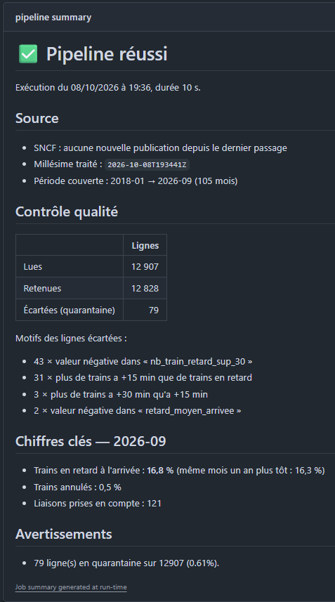
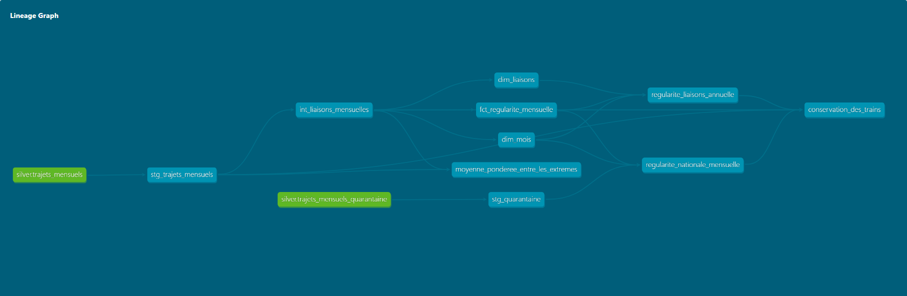
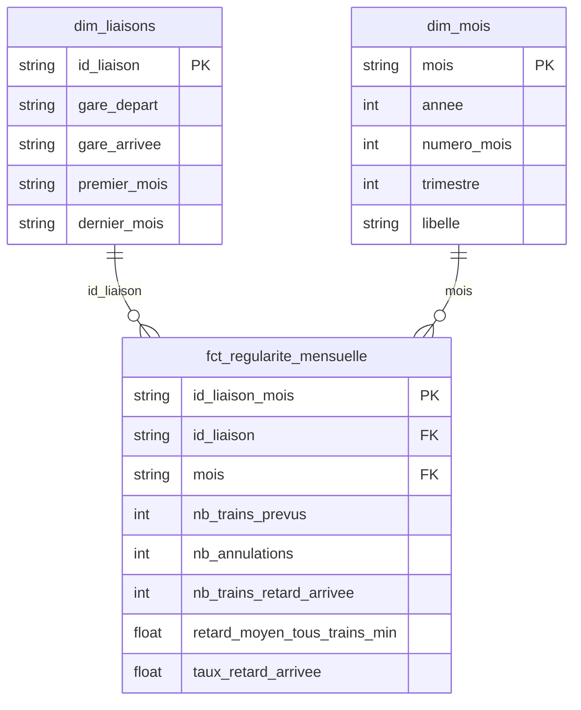
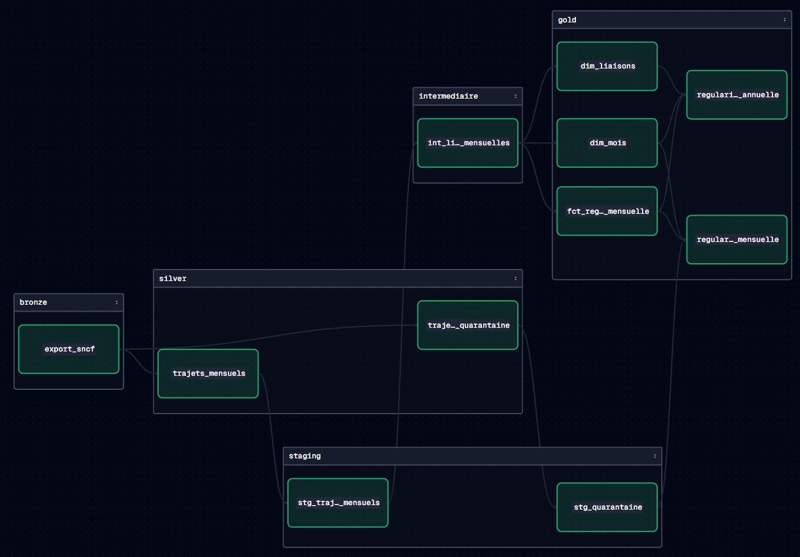

# pipeline-qualite-donnees

[](https://github.com/eliasbabouche/pipeline-qualite-donnees/actions/workflows/tests.yml)
[](https://github.com/eliasbabouche/pipeline-qualite-donnees/actions/workflows/pipeline_mensuel.yml)

> Un pipeline de données qui tourne seul chaque mois, ne casse pas quand la source change de
> format, et prouve que ses chiffres sont justes. Appliqué à la régularité des TGV (open data
> SNCF) : architecture bronze / silver / gold, ingestion idempotente, validation pandera,
> transformations dbt, orchestration Dagster, exécution planifiée dans GitHub Actions.

## Résultat



**Le pipeline.** Chaque 10 du mois, GitHub Actions télécharge l'export SNCF, l'archive, le
valide ligne par ligne, construit les tables d'analyse et publie un rapport en français en tête
de l'exécution. Relancé sur une source inchangée, il ne réécrit rien. Sur le millésime du
8 octobre 2026, **79 lignes sur 12 907 (0,61 %) sont écartées** avec leur motif, dont 43 nombres
de trains négatifs publiés par la source entre janvier et mars 2025 ; 106 tests (68 en Python,
38 dans dbt) vérifient la chaîne, dont la conservation exacte des 3 508 693 trains prévus d'un
bout à l'autre.

**Ce qu'il mesure.** De janvier à septembre 2026, **18,7 % des TGV sont arrivés en retard**,
contre 14,3 % sur la même période de 2025 : c'est le niveau le plus élevé depuis 2018 (18,4 %),
et le meilleur reste 2021 (10,4 %). Les écarts entre liaisons sont forts : en 2025, parmi les
liaisons d'au moins 1 000 trains, Paris → Stuttgart arrive en retard une fois sur deux (56,5 %),
Lausanne → Paris une fois sur quatorze (7,4 %).

| Janvier → septembre | 2018 | 2019 | 2020 | 2021 | 2022 | 2023 | 2024 | 2025 | 2026 |
|---|---|---|---|---|---|---|---|---|---|
| TGV en retard à l'arrivée | 18,4 % | 13,1 % | 12,2 % | 10,4 % | 14,3 % | 14,4 % | 13,6 % | 14,3 % | **18,7 %** |

## Données

| | |
|---|---|
| Source | [Régularité mensuelle TGV par liaisons](https://ressources.data.sncf.com/explore/dataset/regularite-mensuelle-tgv-aqst/) (SNCF Voyageurs) |
| Millésime | **mis à jour chaque mois par construction** ; les chiffres de ce README portent sur le millésime du 8 octobre 2026 |
| Volume | 12 907 lignes, 26 colonnes, 2,9 Mo ; environ 121 liaisons par mois |
| Période | janvier 2018 → septembre 2026 (105 mois) |
| Licence | Licence Ouverte / Open Licence (Etalab) |
| Contrat | [`docs/contrat_donnees.md`](docs/contrat_donnees.md) : colonnes, types, règles, clé, seuils |

Une ligne décrit une liaison (gare de départ → gare d'arrivée), pour un mois et un type de
service : trains prévus, annulés, en retard au départ et à l'arrivée, retards moyens, causes.

Les données ne sont pas versionnées : le pipeline les télécharge (voir Exécution).

### Entonnoir

| Étape | Lignes | % du départ |
|---|---:|---:|
| Lignes lues (bronze) | 12 907 | 100 % |
| Écartées en quarantaine, avec motif | − 79 | |
| **Retenues (silver)** | **12 828** | **99,4 %** |
| Fusion National + International de juillet à septembre 2025 (aucun train perdu) | − 42 | |
| Liaisons-mois (gold) | 12 786 | |

## Méthode

1. **Bronze** : l'export SNCF est archivé octet pour octet, un dossier horodaté par
   téléchargement ; une empreinte SHA-256 identique au dernier millésime n'écrit rien.
2. **Silver** : lecture robuste (encodage, séparateur, colonnes par nom), validation pandera
   ligne par ligne avec quarantaine, puis Parquet partitionné par mois.
3. **Gold** : modèles SQL dbt sur DuckDB, testés à chaque exécution, organisés en **modèle en
   étoile** (une table de faits, deux dimensions) avec deux tables d'agrégats par-dessus ; les
   comptes sont additionnés et les moyennes recalculées en pondérant par le nombre de trains.
4. **Orchestration** : Dagster enchaîne les trois couches, réessaie le téléchargement, s'arrête
   net sur une rupture de contrat ; GitHub Actions le lance chaque mois et garde la mémoire d'un
   mois sur l'autre par artefact.

### Lignage des données

Généré par dbt à partir des dépendances déclarées dans le SQL : en vert les sources (silver),
en bleu les modèles, à droite les deux tests qui vérifient la cohérence des calculs.



### Modèle de données (gold)

Un **modèle en étoile** : au centre, la table de faits (une ligne par liaison et par mois, avec
les mesures), reliée par ses clés aux dimensions qui décrivent le « quoi » et le « quand ». Les
deux tables d'agrégats lues par l'analyste sont construites en joignant les faits à leurs
dimensions ; des tests dbt de relations garantissent que chaque clé des faits existe dans sa
dimension.



| Table | Rôle | Lignes |
|---|---|---:|
| `fct_regularite_mensuelle` | faits : une ligne par liaison et par mois | 12 786 |
| `dim_liaisons` | dimension : une ligne par liaison (gare de départ → gare d'arrivée) | 130 |
| `dim_mois` | dimension calendrier : année, trimestre, libellé | 105 |
| `regularite_nationale_mensuelle` | agrégat : tout le réseau, par mois | 105 |
| `regularite_liaisons_annuelle` | agrégat : chaque liaison, par année, pour classer | 1 105 |

### Orchestration

Dagster exécute l'ensemble comme un seul graphe d'assets, de l'export SNCF aux tables gold :
chaque modèle dbt y devient un asset, rangé dans le groupe de sa couche.



## Ce qui se passe quand la source change

Chaque changement plausible a un comportement défini et un test qui le vérifie. Le principe :
**tolérer ce qui est sans ambiguïté, bloquer ce qui est ambigu.**

| Changement | Réaction | Pourquoi |
|---|---|---|
| encodage latin-1 au lieu d'UTF-8 | bloquant, avec l'octet fautif et sa position | deviner l'encodage peut corrompre les accents sans erreur visible |
| séparateur `,` au lieu de `;` | lecture adaptée + avertissement | le séparateur est validé par les colonnes qu'il produit |
| colonnes dans un autre ordre | aucun effet | les colonnes sont toujours lues par leur nom |
| colonne renommée ou supprimée | bloquant, en nommant l'ancienne et la nouvelle | un chiffre attribué à la mauvaise colonne serait faux sans bruit |
| clé en double | bloquant, sans dédoublonnage | choisir une des deux lignes reviendrait à inventer la donnée |
| mois disparus depuis le dernier export | bloquant | signe d'une republication partielle ou tronquée |
| lignes incohérentes | quarantaine, bloquant au-delà de 2 % | une erreur isolée n'arrête pas tout ; une erreur massive, si |
| plantage en pleine écriture | aucun état partiel | chaque couche est écrite à côté puis mise en place par renommage |

Exemple : si la colonne `nb_train_prevu` devient `nb_trains_prevus`, le pipeline s'arrête avec

```
ErreurContrat: Colonne(s) obligatoire(s) absente(s) : nb_train_prevu.
Colonne(s) inconnue(s) presente(s) : nb_trains_prevus -- renommage probable cote source.
```

et le rapport de l'exécution indique que les données précédentes restent intactes et ce qu'il
faut faire. Une fois la cause corrigée, une reconstruction depuis bronze (*backfill*,
`python -m src.silver --forcer`) suffit, sans rien retélécharger.

## Tests de données

| Où | Nombre | Ce qu'ils protègent |
|---|---:|---|
| `tests/test_ingestion.py` | 8 | idempotence (deux passages = un seul millésime), plantage simulé pendant l'écriture, reprise après interruption |
| `tests/test_lecture.py` | 11 | un test par piège de format : latin-1, virgule, colonne renommée, supprimée, déplacée, en trop, retours à la ligne dans un champ |
| `tests/test_validation.py` | 22 | chaque règle de quarantaine, dont les anomalies réelles de 2019 et 2025 ; clé en double, mois manquant, mois incomplet, seuil de 2 % |
| `tests/test_silver.py` | 10 | partitions, backfill, et trois échecs qui laissent l'ancien silver intact |
| `tests/test_orchestration.py` | 6 | graphe relié de bronze à gold, réessais réservés au réseau, arrêt sur erreur de contrat |
| `tests/test_rapport.py` | 8 | rapport de succès et d'échec, traduction des motifs, erreur remontée jusqu'au rapport |
| `tests/test_config.py` | 3 | paramètres de lecture explicites |
| dbt : `unique`, `not_null`, `accepted_values`, `relationships` | 27 | clés uniques à chaque niveau, services autorisés, chaque clé des faits présente dans sa dimension |
| dbt : `entre_bornes` (test maison) | 9 | taux entre 0 et 1, nombres de trains positifs, numéros de mois entre 1 et 12 |
| dbt : `conservation_des_trains` | 1 | le total des trains prévus est identique du staging aux faits et aux deux agrégats |
| dbt : `moyenne_ponderee_entre_les_extremes` | 1 | une moyenne pondérée reste entre les valeurs qu'elle combine |

Aucun test n'utilise le réseau : le téléchargement est simulé.

## Deux choix de méthode qui changent le résultat

**Écarter les lignes incohérentes plutôt que bloquer ou laisser passer.**

- Une ligne qui viole une règle métier part en quarantaine avec son motif ; au-delà de 2 % de
  lignes écartées, le pipeline bloque, car une anomalie massive signale un changement de format.
- Bloquer à la première anomalie aurait arrêté le pipeline chaque mois depuis janvier 2025
  (43 nombres de trains négatifs publiés par la source) ; laisser passer aurait fait entrer ces
  valeurs dans les moyennes. Le coût est assumé et visible : en janvier 2025, le taux national
  porte sur 103 liaisons au lieu de 121, et la table gold le signale.

**Additionner les comptes, puis recalculer les moyennes.**

- Quand une liaison est publiée en deux lignes (National et International), les nombres de
  trains sont additionnés et les retards moyens recalculés en pondérant par le nombre de trains.
- Une moyenne simple des deux lignes donnerait 5,6 min au lieu de 5,4 min pour Dijon → Paris en
  juillet 2025 ; dédoublonner ces lignes aurait retiré environ 7 000 trains. Un test dbt vérifie
  que le total des trains est conservé d'un bout à l'autre, un autre que chaque moyenne pondérée
  reste encadrée.

## Limites connues

- **La définition du retard dépend de la durée du trajet** (5 min sous 1 h 30, 10 min jusqu'à
  3 h, 15 min au-delà, selon la SNCF) : comparer les taux de liaisons de durées très différentes
  revient à comparer des seuils différents.
- **Les liaisons en quarantaine sont absentes des taux de leur mois** (11 à 18 liaisons de
  janvier à mars 2025). La table nationale les compte (`nb_liaisons_en_quarantaine`) sans les
  corriger.
- **Les colonnes « plus de 30 min » et « plus de 60 min » ne sont pas emboîtées** dans 354 lignes ;
  la source ne documente pas leur définition exacte, donc aucun indicateur ne s'appuie sur leur
  différence.
- **Une correction rétroactive de la SNCF est adoptée sans rapport de différences** : silver
  repart du dernier millésime, l'ancien reste consultable en bronze.
- **GitHub désactive les workflows planifiés après 60 jours sans activité sur le dépôt**, et les
  artefacts qui portent la mémoire expirent après 90 jours : trois mois d'échec consécutifs font
  repartir le pipeline à vide, sans contrôle de couverture pour cette exécution-là.
- Bronze conserve le CSV d'origine et non du Parquet : c'est voulu, un fichier illisible devant
  pouvoir être archivé pour prouver ce que la source a envoyé.

## Ce qui a été difficile, et ce que j'en retiens

- **La source réelle était plus sale que prévu.** Un découpage National / International sur
  trois mois, des nombres de trains négatifs, des liaisons à zéro train prévu mais avec des
  annulations en 2020. Aucune de ces anomalies ne produit d'erreur : elles ne se voient qu'en
  mesurant chaque colonne avant d'écrire la moindre règle. Le contrat de données s'appuie donc
  sur des chiffres constatés, et les anomalies connues y sont listées une par une.
- **Les tests ont trouvé des bugs que je n'avais pas vus.** Un fichier dont toutes les lignes
  partaient en quarantaine produisait une erreur pandas incompréhensible ; un test dbt a révélé
  63 nombres de trains ayant circulé négatifs ; et l'un de mes propres tests d'encodage était
  faux, ce que seule la lecture attentive du message d'échec a montré. D'où la contre-épreuve
  systématique.
- **Une machine de CI n'a pas de mémoire.** Lancer le pipeline dans GitHub Actions était simple ;
  lui faire garder les millésimes d'un mois sur l'autre ne l'était pas. La solution par artefact,
  republié seulement en cas de succès, a été vérifiée en lançant le workflow deux fois de suite.

## Exécution

Python 3.12, sous Windows (PowerShell) ; remplacer `.venv\Scripts\Activate.ps1` par
`source .venv/bin/activate` sous Linux ou macOS.

```powershell
python -m venv .venv
.venv\Scripts\Activate.ps1
pip install -r requirements.txt

python -m src.executer                 # pipeline complet + rapport dans donnees/rapport_execution.md
dagster dev -m src.orchestration       # interface Dagster sur http://localhost:3000
```

Étape par étape : `python -m src.ingestion`, `python -m src.silver`, puis `dbt build` depuis le
dossier `transformations/`. Documentation dbt et graphe de lignage : `dbt docs generate` puis
`dbt docs serve`.

```powershell
pytest                                 # 68 tests Python
cd transformations; dbt build          # 8 modèles et 38 tests de données
```

## Structure

```
src/
  config.py          chemins, URL de la source, seuils
  contrat.py         le contrat de données en code : colonnes, types, clé
  ingestion.py       bronze : téléchargement, empreinte, écriture atomique
  lecture.py         encodage, séparateur, colonnes par nom
  validation.py      schéma pandera, quarantaine, contrôles bloquants
  silver.py          silver : Parquet partitionné, remplacement atomique, backfill
  orchestration.py   assets Dagster, job et planification
  rapport.py         rapport d'exécution lisible
  executer.py        point d'entrée : pipeline + journal + rapport
transformations/     projet dbt : staging, intermediaire, gold (étoile + agrégats), tests
tests/               tests pytest sur données volontairement dégradées
docs/                contrat de données et captures
donnees/             bronze, silver, gold (non versionnés)
.github/workflows/   tests à chaque push, pipeline chaque mois
```

## Questions fréquentes

<details>
<summary><b>Pourquoi la clé d'unicité inclut-elle la colonne <code>service</code> ?</b></summary>

J'ai d'abord supposé qu'une ligne était identifiée par le mois, la gare de départ et la gare
d'arrivée. En le vérifiant, j'ai trouvé 42 lignes qui violaient cette règle, toutes sur juillet,
août et septembre 2025 : pendant ces trois mois, la SNCF a découpé certaines liaisons en deux
lignes, trafic national et trafic international, avant de revenir au format habituel. Ce
n'étaient pas des doublons mais deux moitiés d'une même liaison : Dijon → Paris Lyon en
juillet 2025, c'est 186 trains « International » plus 220 « National ».

Sans cette vérification, le pipeline aurait soit échoué sans explication, soit, pire, dédoublonné
en silence et retiré environ 7 000 trains des statistiques. La clé
`date + gare_depart + gare_arrivee + service` (zéro conflit sur l'export du 24 septembre 2026,
12 544 lignes) est donc écrite
dans le contrat de données, et un test d'unicité fait échouer le pipeline au lieu de corriger en
douce.

</details>

<details>
<summary><b>Qu'est-ce que l'exploration manuelle de la source a changé au code ?</b></summary>

Quatre constats, chacun avec une conséquence directe :

- **Le fichier commence par un BOM UTF-8.** Il est lu en `utf-8-sig` ; sinon la première colonne
  s'appelle date précédé de trois octets invisibles, et tout accès à `date` échoue.
- **La colonne `date` est un mois (`2025-07`), pas une date.** Elle reste une période mensuelle
  et sert de clé de partition ; la convertir en date inventerait un « 1er du mois » absent des
  données.
- **Les commentaires contiennent des retours à la ligne entre guillemets.** Le fichier fait
  15 062 lignes physiques pour 12 544 lignes de données (export du 24 septembre 2026) : les
  lignes ne se comptent jamais à la main, seulement via un lecteur CSV qui gère les guillemets.
- **Chaque export contient tout l'historique depuis 2018.** C'est un *snapshot*, pas un *delta* :
  chaque téléchargement est archivé tel quel en bronze, et silver est reconstruit à partir du
  plus récent.

</details>

<details>
<summary><b>Pourquoi certaines anomalies arrêtent le pipeline et d'autres non ?</b></summary>

Parce qu'une anomalie sur le fichier et une anomalie sur une ligne ne disent pas la même chose.
Le [contrat de données](docs/contrat_donnees.md) distingue trois niveaux :

- **Bloquant** quand c'est la structure qui casse : encodage illisible, colonne absente ou
  renommée, clé en double, mois disparus de l'historique. Continuer produirait des chiffres faux
  sur tout le jeu de données : le pipeline s'arrête avec un message qui nomme le problème.
- **Quarantaine** quand une ligne isolée est incohérente : la ligne est écartée, conservée avec
  son motif de rejet, et comptée dans le rapport. Exemple réel : de janvier à mars 2025, la
  source publie 43 nombres de trains **négatifs** (jusqu'à −44). Bloquer tout le pipeline pour
  ça rendrait l'historique inexploitable ; les laisser passer fausserait les moyennes.
- **Avertissement** quand l'écart est sans conséquence : colonnes dans un ordre différent,
  séparateur changé mais sans ambiguïté.

Le garde-fou qui relie les deux premiers niveaux : au-delà de 2 % de lignes en quarantaine, le
pipeline bloque, parce qu'une anomalie massive n'est plus une erreur de saisie mais un
changement de format. Au millésime du 8 octobre 2026, 79 lignes sur 12 907 sont écartées, soit
0,61 %.

</details>

<details>
<summary><b>Comment l'ingestion garantit-elle qu'on peut la relancer sans risque ?</b></summary>

Par deux propriétés, chacune prouvée par un test.

**Idempotence : relancer ne duplique rien.** Chaque export téléchargé est résumé par son
empreinte SHA-256, enregistrée dans les métadonnées du millésime. Au passage suivant, le
pipeline compare l'empreinte du nouveau téléchargement à celle du dernier millésime : identique,
il n'écrit rien ; différente, il archive un nouveau millésime sans toucher aux précédents.
J'ai d'abord vérifié que l'export SNCF est déterministe (trois téléchargements successifs, même
empreinte) : sinon chaque passage aurait semblé nouveau et l'idempotence par empreinte aurait
été impossible.

**Atomicité : un échec ne laisse jamais un état à moitié écrit.** Un millésime est écrit dans
un dossier temporaire, puis renommé en une seule opération : il existe entièrement ou pas du
tout. Le fichier de métadonnées est écrit en dernier et sert de certificat de complétude. Si le
processus est tué en plein milieu, le dossier temporaire restant est supprimé au lancement
suivant. Les tests simulent un disque plein au moment du renommage et une interruption brutale,
puis vérifient que bronze ne contient rien de partiel.

Bronze conserve le CSV d'origine plutôt qu'une conversion en Parquet : un fichier illisible doit
pouvoir être archivé, justement pour prouver ce que la source a envoyé.

</details>

<details>
<summary><b>Que se passe-t-il si la SNCF change le format du fichier sans prévenir ?</b></summary>

Le pipeline distingue ce qui est sans ambiguïté de ce qui ne l'est pas. Des colonnes dans un autre
ordre ou un séparateur différent sont tolérés, parce que les colonnes sont lues par leur nom et
que le séparateur est validé par les colonnes qu'il produit. Un encodage inattendu, une colonne
renommée, une clé en double ou des mois disparus arrêtent tout, avec un message qui nomme le
problème : continuer produirait des chiffres faux sans aucun signal. Dans tous ces cas, rien
n'est écrit et la version précédente reste intacte ; une fois la cause corrigée, on reconstruit
depuis bronze sans retélécharger. Le détail, cas par cas, est dans la section
[Ce qui se passe quand la source change](#ce-qui-se-passe-quand-la-source-change).

</details>

<details>
<summary><b>Pourquoi dbt, et comment prouver que les chiffres de gold sont justes ?</b></summary>

dbt transforme le SQL en code géré comme du logiciel. Chaque table est un fichier `.sql` qui ne
contient qu'un `SELECT` ; les `ref()` entre fichiers déclarent les dépendances, dont dbt déduit
l'ordre d'exécution et le graphe de lignage. Les tests de données sont déclarés à côté des
modèles et s'exécutent avec eux : `dbt build` refuse de construire une table si un test en amont
échoue, donc une donnée fausse ne se propage pas jusqu'à gold.

La règle de calcul centrale : **additionner les comptes, puis recalculer les moyennes à partir
des sommes, jamais de moyenne de moyennes.** Quand la SNCF publie Dijon → Paris en deux lignes
(186 trains internationaux à 8,5 min de retard moyen, 220 nationaux à 2,8 min), la moyenne
pondérée donne 5,4 min ; la moyenne simple donnerait 5,6 min, en accordant le même poids aux deux
groupes.

Pour prouver les chiffres, 38 tests dbt, dont deux qui vérifient des propriétés mathématiques
plutôt que des formats :

- **conservation des trains** : le total des trains prévus (3 508 693 au millésime du
  8 octobre 2026) est identique à chaque étage, du staging à la table de faits et aux agrégats. Une jointure
  qui duplique des lignes ou un filtre oublié le fait échouer ;
- **moyenne pondérée encadrée** : une moyenne pondérée tombe toujours entre la plus petite et la
  plus grande des valeurs qu'elle combine ; sinon, les poids sont faux.

Ces tests ont trouvé un vrai défaut : en 2020, 63 liaisons comptaient des annulations pour zéro
train prévu, ce qui donnait un nombre de trains ayant circulé négatif. Le calcul a été corrigé
avant que gold ne soit construit.

</details>

<details>
<summary><b>Pourquoi un modèle en étoile dans la couche gold ?</b></summary>

Parce qu'il sépare ce qu'on mesure de ce qui le décrit. La **table de faits** contient une ligne
par liaison et par mois (son *grain*) et uniquement des mesures : trains prévus, annulés, en
retard, retards moyens, plus deux clés. Les **dimensions** portent les descriptions : la liaison
(gares de départ et d'arrivée, premier et dernier mois publiés), le mois (année, trimestre,
libellé). Une analyse part des faits et joint les dimensions dont elle a besoin : les deux tables
d'agrégats du projet sont construites exactement ainsi.

Ce que ça apporte : une description ne vit qu'à un endroit (renommer une gare, ajouter un
attribut au calendrier ne touche qu'une dimension), et c'est le format qu'attendent les outils
de restitution comme Power BI. Le risque classique est la jointure qui multiplie les lignes, si
une dimension contient deux fois la même clé : les tests dbt vérifient que chaque clé de
dimension est unique, que chaque clé des faits existe dans sa dimension, et que le total des
trains reste identique avant et après les jointures.

</details>

<details>
<summary><b>Pourquoi Dagster plutôt qu'un script qui enchaîne les étapes ?</b></summary>

Un script `main.py` qui appelle l'ingestion, puis silver, puis dbt fonctionne, jusqu'au premier
problème : il ne sait pas quoi réessayer, ne garde aucun historique et ne montre pas où la chaîne
s'est arrêtée. Un orchestrateur prend en charge ces trois points.

J'ai choisi Dagster plutôt qu'Airflow, l'outil le plus répandu en entreprise, parce qu'il raisonne
en **assets**, les données produites, plutôt qu'en tâches. Je déclare que silver dépend de bronze
et Dagster en déduit l'ordre, exactement comme dbt avec ses `ref()`. L'intégration dagster-dbt
transforme chaque modèle dbt en asset : le pipeline forme un seul graphe, de l'export SNCF aux
tables gold, à moitié Python et à moitié SQL, raccordé par le nom de la source dbt.

Deux décisions de conception :

- **Réessayer seulement ce qui peut réussir au deuxième essai.** Le téléchargement est réessayé
  trois fois à une minute d'intervalle (site lent, coupure). Une erreur de contrat ne l'est
  jamais : le même fichier donnerait la même erreur. Le pipeline s'arrête aussitôt avec le
  message, et un test le vérifie.
- **Planification le 10 de chaque mois, heure de Paris**, la SNCF publiant avec environ un mois
  de décalage. Si rien n'a été publié, l'idempotence garantit qu'aucune donnée n'est réécrite.

</details>

<details>
<summary><b>Comment le pipeline tourne-t-il tout seul chaque mois, et comment savoir s'il a réussi ?</b></summary>

Un workflow GitHub Actions le lance le 10 de chaque mois. La difficulté : la machine démarre vide
à chaque exécution, donc sans mémoire des millésimes précédents ; le contrôle « aucun mois ne
doit disparaître depuis le dernier export » n'aurait alors jamais rien à comparer. La mémoire
passe par un **artefact GitHub** : bronze et silver sont récupérés depuis la dernière exécution
réussie au début, puis republiés à la fin, **uniquement en cas de succès**, pour qu'un mois en
échec ne remplace jamais le dernier état sain. Je l'ai vérifié en lançant le workflow deux fois
de suite : la seconde exécution a récupéré l'état de la première et conclu « aucune nouvelle
publication », sans rien réécrire.

Pour savoir s'il a réussi, chaque exécution produit un **rapport en français** affiché en tête de
la page GitHub : statut, millésime traité, lignes lues, retenues et écartées avec leurs motifs
traduits (« valeur négative dans … » plutôt que `greater_than_or_equal_to(0)`), et les chiffres
clés du dernier mois. En cas d'échec, le rapport cite l'erreur, rappelle que les données
précédentes sont intactes et dit quoi faire ; la CI passe au rouge, ce qui déclenche un mail.
En parallèle, un journal JSON (une ligne par événement) garde la trace technique, exploitable
par un programme.

</details>

## Licence

MIT — voir [LICENSE](LICENSE).

